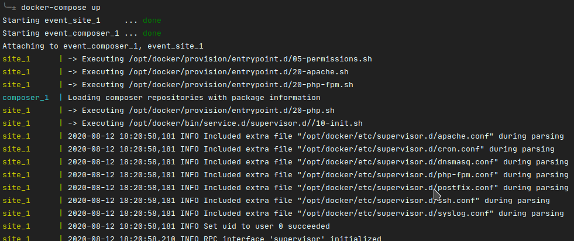
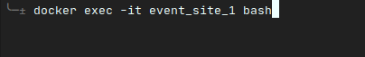
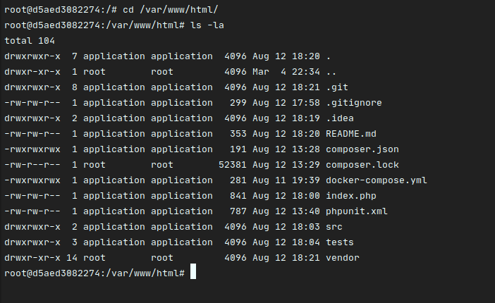
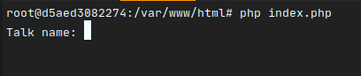
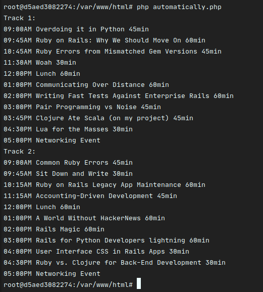
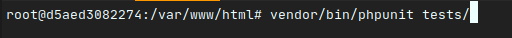

# event

## Instructions

#### Requirements
* Docker
* Disable others services that be running in port 80

#### Run
##### In the terminal run this code:
```
docker-compose up
```

***This code will download all dependencies***



#### Open other terminal and run this code to enter in container:
```
docker exec -it event_site_1 bash
``` 



***Check the container name, in my case the name is event_site_1***

#### In container, browser to project folder: 
```
cd /var/www/html/
```



#### Finally run this code to start application
```
php index.php
```


#### Or run the code below to automatically add and show result
```
php automatically.php 
```


## Run test
```
vendor/bin/phpunit tests/
```
